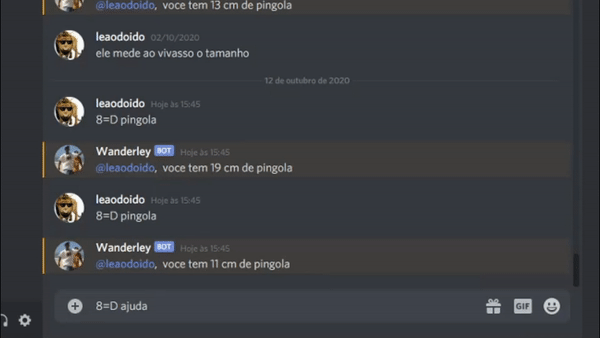

# Bot Wanderley, O bot que so da ideia errada

### Boy Wanderley em ação
---


### Instalando o projeto localmente
---
Antes de iniciar, você precisará ter instalado o [node.js](https://nodejs.org/en/download/) em sua máquina.

#### Configuração básica para desenvolvimento
Para iniciar o bot, você precisará da chave que pode ser obtida através do [Discord Developers Portal](https://www.discord.com/developers) e adicionar um arquivo `.env` na raíz do projeto com a seguinte variável:
  ```
    DISCORD_BOT_TOKEN=SUA_DISCORD_TOKEN
  ```

#### Para instalar as dependencias do projeto:
  ```bash
    $ npm install
  ```

#### Para iniciar o Wanderley:
  ```bash
    $ npm run start
  ```


### Docker
---
#### Para fazer a build da imagem do docker:
Adicione a sua TOKEN obtida através do [Discord Developers Portal](https://www.discord.com/developers) no arquivo `Dockerfile` e execute:
  ```bash
    $ docker build . -t wanderley
  ```
#### Para iniciar o container:
  ```bash
    $ docker run wanderley
  ```
